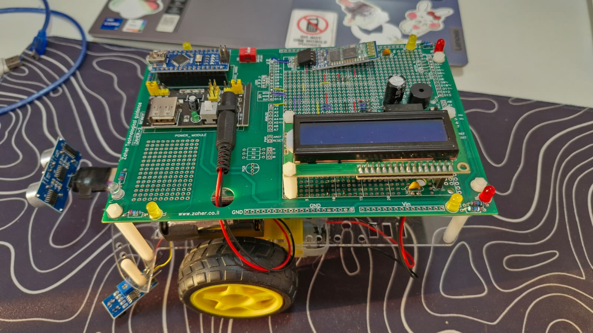

# Real-Time Arduino Robot Mapper

This project uses an Arduino-controlled robot to perform real-time 2D mapping. A Python script with a Pygame GUI controls the robot, receives sensor data, and visualizes the robot's environment, plotting obstacles as it explores.

It builds upon and integrates the functionality of the [Edge_Avoiding_Bluetooth_Arduino]([https://github.com/SkibidiRany/Edge_Avoiding_Bluetooth_Arduino]) project, transitioning from simple remote control to a sophisticated 2D mapping system.



---

## 🚀 Core Features

* **Live 2D Visualization**: A Pygame window displays the robot's position and maps out detected obstacles in real-time.
* **Keyboard Control**: Seamlessly drive the robot using your keyboard's W, A, S, D keys.
* **Serial Communication**: A robust serial communication protocol between the Python script and the Arduino allows for sending commands and receiving sensor data.
* **Autonomous Edge Avoidance**: The Arduino is programmed with a "fall-safe" mechanism, using its IR sensors to automatically back away from edges, even while being controlled remotely.
* **Modular Codebase**: The Python code is logically separated into modules for robot state, serial communication, and map visualization, making it easy to understand and extend.

---

## 🏗️ System Architecture

The project operates with two main components communicating over a USB serial connection:

1.  **The Agent (Arduino Robot)**: The physical robot that executes commands and senses the environment.
    * **Receives** movement commands (`forward`, `left`, etc.) from the Python script.
    * **Executes** these commands by controlling its motors via `Move()` functions.
    * **Continuously** reads its ultrasonic and IR sensors.
    * **Sends** formatted sensor data back to the Python script.
    * **Independently** handles emergency situations, like detecting an edge with its IR sensors, triggering the `DealWithFall()` function to prevent a fall.

2.  **The Controller (Python & Pygame)**: The script running on a host computer.
    * **Captures** keyboard input (W, A, S, D) to determine the desired movement command.
    * **Sends** the command to the Arduino via the `ArduinoRobot` class.
    * **Receives** and parses sensor data from the Arduino using the `read_sensors` method.
    * **Calculates** the position of a detected obstacle using the robot's current position, direction, and the ultrasonic sensor's distance reading.
    * **Renders** the robot's position and the detected obstacle points to the screen in real-time using the `MapVisualizer` class.

---

## 🛠️ Hardware & Software

### Hardware Components

* Arduino (Uno/Nano or similar)
* L298N Motor Driver
* 2x DC Motors with Wheels
* HC-SR04 Ultrasonic Sensor
* 2x IR (Infrared) Proximity Sensors
* Robot Chassis, Power Source (Batteries), and Wires

### Software Requirements

* **Python 3.x**
* **Pygame**: For the GUI and visualization.
* **PySerial**: For communication with the Arduino.
* **NumPy**: For efficient vector and matrix calculations.
* **Arduino IDE**: To upload the sketch to the robot.

---

## ⚙️ Setup and Installation

1.  **Assemble the Robot**: Build the robot, connecting the motors, motor driver, and sensors to the correct pins on the Arduino as defined in `ArduinoCode.ino`.

2.  **Flash the Arduino**: Open `ArduinoCode.ino` in the Arduino IDE and upload it to your board.

3.  **Set Up Python Environment**:
    * Clone or download the project files to your computer.
    * Open a terminal or command prompt in the project directory.
    * Install the required Python packages:
        ```bash
        pip install pygame pyserial numpy
        ```

---

## ▶️ How to Run

1.  **Connect the Robot**: Plug the Arduino robot into your computer via USB or Bluetooth, both are equally supported.

2.  **Configure COM Port**: Open the `main.py` file and update the COM port in this line to match the one your Arduino is using:
    ```python
    arduino = ArduinoRobot(port="COM3")  # Change "COM3" if needed
    ```

3.  **Launch the Application**: Run the main script from your terminal:
    ```bash
    python main.py
    ```

4.  **Control the Robot**: A Pygame window will appear. Click on the window to give it focus, then use the **W, A, S, D keys** to drive the robot. The map will automatically update with data from the ultrasonic sensor.

---

## 📂 Code Structure

* `main.py`: The entry point of the application. Handles the main loop, user input, and coordinates communication between the robot and the visualizer.
* `arduino_serial.py`: Defines the `ArduinoRobot` class, which manages all serial communication (sending commands and parsing sensor data).
* `map.py`: Contains the `MapVisualizer` class, responsible for all Pygame rendering, including drawing the robot and the discovered points.
* `robot.py`: Defines the `RobotState` class for managing the robot's position and orientation.
* `geometry.py` & `utils.py`: Helper files containing mathematical functions for vector operations, rotations, and unit conversions.
* `ArduinoCode.ino`: The sketch running on the Arduino. It handles motor control, sensor reading, and the fall-prevention logic.